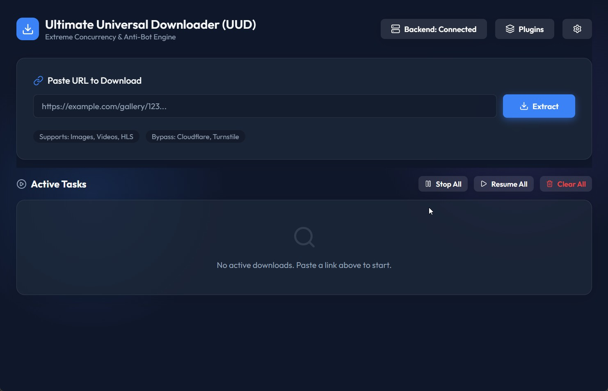
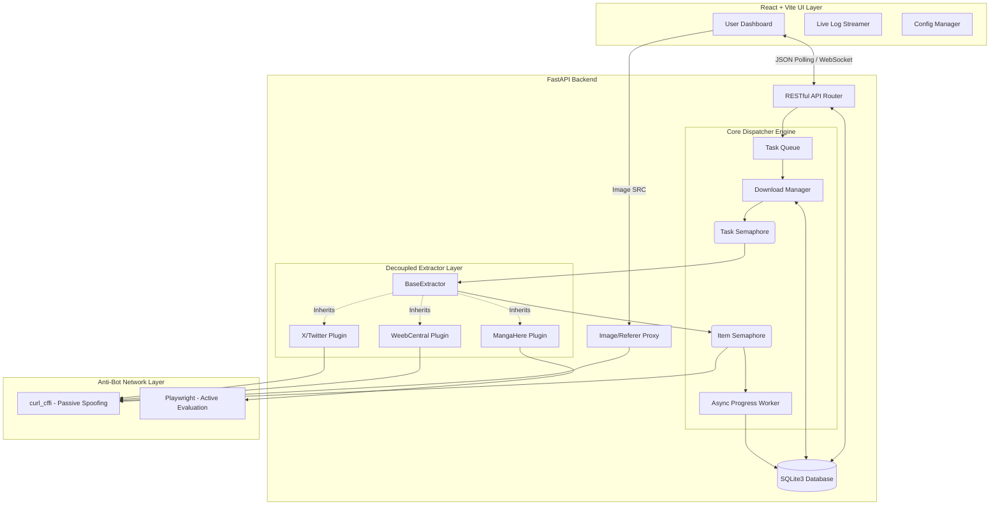

# Ultimate Universal Downloader (UUD)

Ultimate Universal Downloader (UUD) is a state-of-the-art desktop application built with Python and React designed to effortlessly download media (images, gifs, files, videos) from virtually any website. Built for extreme concurrency and resilience, it bypasses modern WAFs (Web Application Firewalls) and anti-bot protections like Cloudflare and Turnstile.



## 🚀 Features

* **Sleek Desktop UI:** A gorgeous, responsive React + TailwindCSS (vanilla CSS module) frontend bundled into a native desktop window via `pywebview`.
* **Sticky & Scalable Interface:** Pin the top header and URL extraction section for easy access while scrolling through massive task lists, and use the custom **UI Scale Slider** (0.5x to 1.5x) to resize the entire application dynamically.
* **Unblockable Core:** Uses `curl_cffi` to perfectly spoof Chrome TLS fingerprints (JA3/JA4) avoiding instant WAF blocks.
* **Extreme Parallel Concurrency:** Download multiple tasks at once and multiple items inside a task at once using an intelligent `asyncio.Semaphore` dispatcher block. Configure `Max Tasks` and `Max Items` directly in the UI.
* **Hierarchical Progress UI:** Tasks dynamically group expected media into specific sub-folders (like chapters or galleries) and present a scrollable dropdown of micro-progress bars tracking the exact download status of every single sub-folder independently!
* **Live Dynamic Thumbnails:** Fetches and renders official cover images directly in the UI dashboard. Includes an internal **Image Proxy API** that dynamically spoofs HTTP `Referer` headers to bypass remote CDN hotlink-protection blocks when rendering images.
* **Robust Task Management:**
  * **Global Operations**: Instantly "Stop All", "Resume All", or "Clear All" (safely clear finished/dead tasks without deleting files) natively from the UI header.
  * **Live Log Viewer Modal**: The engine automatically writes all plugin extraction decisions, byte-level download operations, and internal exceptions to flat `.log` files in the background. Simply click the green **Info** button on any task to pop open a sleek streaming glass-morphism terminal overlay and trace exactly what the engine is doing! (Fully supports drag-to-highlight and copy/paste text directly from the log stream!)
  * **Dynamic Visual Status Borders**: Active tasks intelligently color-code their glass panels to instantly convey their status: **Green** (Perfect 100% completion), **Yellow** (Completed but missing/failed items), **Blue** (Currently extracting metadata), and **Red** (Fatal error).
  * **Real-time ETA & Completion Tracking**: The core dispatcher dynamically calculates download velocities to predict a precise ETA while a task runs. Once finished, it seamlessly logs the total elapsed time directly into the UI dashboard for benchmarking.
  * **Smart Restart & Delta Downloads**: If a task fails midway (or if you accidentally stop it), simply click the "Restart" button. The engine performs local delta-checks against your hard drive and instantly skips any files that already exist, only downloading what's missing.
  * **Incomplete Download Alerts**: If a task finishes but Cloudflare or a WAF blocked certain files, the UI's item counter will intelligently turn **bright red** to alert you that the gallery is incomplete, prompting you to use the Smart Restart feature!
  * **Persistent Subtask Cancellation**: Intelligently cancel and delete specific sub-folders (like chapters or galleries) directly from the UI while the download is active. The engine safely skips canceled items and automatically cleans up the associated files from your hard drive. This cancellation is permanently saved to the database, meaning even if you restart the task or reboot the app, deleted chapters will stay dead forever!
  * **Clickable Task URLs**: Instantly launch the origin URL of any active task directly in your default browser with a single click.
  * **Smart Clipboard Interception**: Press `Ctrl+V` anywhere in the app to instantly grab links from your clipboard and queue them for download. If you are focused inside the URL text box, it safely falls back to native browser pasting so you can review before extracting!
  * **Duplicate Task Protection**: The engine actively monitors your download list. If you accidentally paste a URL you're already downloading, a smart confirmation dialog intercepts the request to prevent wasteful duplication.
  * **Pause & Resume**: Mid-download halting that securely pauses network sessions without losing progress.
  * **Advanced Deletion**: A custom modal provides options to safely clean up dead tasks (soft-deletes), or explicitly purge and delete downloaded files from your native OS hard drive.
  * **Native OS Integration**: A single click instantly opens the target directory natively in your Windows File Explorer.
* **Dynamic Favicon Support:** Built-in plugin modal dynamically pulls and injects the official website favicon for each loaded script, piped securely through Google's `s2/favicons` API.
* **Custom Configuration API:** Change application settings natively from the UI and safely apply them with an explicit Save button to a persistent `settings.json` file.
* **Dynamic Plugin Architecture:** Website extraction scripts are completely decoupled from the main application. Drop new `.py` scripts into the `plugins/` directory, and the app will automatically load them. Built-in support includes:

| Website Name | URL | Type of Website | Type of Media | Example URL |
| :--- | :--- | :--- | :--- | :--- |
| **MangaHere** | `mangahere.cc`, `mangahere.co` | Manga | Images | `https://www.mangahere.cc/manga/example/` |
| **WeebCentral** | `weebcentral.com` | Manga / Manhwa | Images | `https://weebcentral.com/series/0123/example` |
| **X / Twitter** | `x.com`, `twitter.com` | Social Media | Video & GIF | `https://x.com/user/status/12345` |

---

## 🔬 Comprehensive Technical Architecture

UUD is engineered for extreme throughput, stealth, and decoupled maintainability. It achieves this through a high-performance multi-layered architecture:



### 1. Technology Stack Breakdown
* **Frontend Layer**: 
  * **React 18**: Provides a heavily reactive, state-driven dashboard capable of rendering thousands of concurrent DOM updates without stuttering.
  * **Vite**: Used for lightning-fast HMR during development and bundled static generation.
  * **Vanilla CSS Modules**: Completely custom glassmorphism implementation to guarantee a lightweight, dependency-free premium aesthetic.
  * **Lucide React**: Vector icon suite for crisp, scalable UI iconography.
  * **PyWebview**: Wraps the React SPA into a native edge-chromium desktop container to avoid the massive memory overhead of Electron.
* **Backend Layer**:
  * **FastAPI**: Asynchronous Python web framework that simultaneously serves the Vite static files and provides a blazing-fast REST JSON API.
  * **SQLAlchemy & SQLite3**: A file-based persistent database layer storing task parameters, hierarchical sub-folder progress trees, and state recovery variables.
* **Network & Stealth Layer**:
  * **curl_cffi**: A Python binding for `curl-impersonate`. It mathematically replicates the exact TLS/SSL cipher suites and HTTP/2 multiplexing signatures of Google Chrome (JA3/JA4 fingerprints), allowing UUD to passively phase through Cloudflare and WAFs.
  * **Playwright**: Utilized via `async_playwright` to instantiate headless Chromium browsers on-the-fly. This allows UUD to defeat complex JavaScript challenges (like Turnstile) and evaluate obfuscated DOM hashes in a genuine V8 engine.

### 2. Concurrency & Dispatcher Pipeline (Asyncio Engine)
The core downloader engine (`backend/core/downloader.py`) operates entirely asynchronously, utilizing a high-performance Dispatcher Block rather than naive sequential loops.
* **Global Concurrency Limits**: 
  * `asyncio.Semaphore(max_tasks)` locks the maximum number of concurrent parent jobs (e.g., scraping 3 galleries at once).
  * `asyncio.Semaphore(max_items)` imposes a global lock across *all* active tasks, ensuring the total number of simultaneous HTTP streams never exceeds OS file descriptor limits or triggers immediate DDoS bans.
* **Asynchronous File I/O**: `aiofiles` is used to stream binary chunks directly to the hard drive, preventing the Python event loop from blocking during high-speed gigabit transfers.
* **Progress Batching Daemon**: Emitting thousands of database progress events per second inevitably causes SQLite `database locked` exceptions. UUD intercepts all byte-level progress updates and routes them into a decoupled `_progress_queue`. A dedicated background daemon (`_progress_worker`) batches these ticks in memory and commits them safely every 500ms.

### 3. Decoupled Plugin Interface
Web scrapers die the moment a website updates its DOM. To mitigate this, UUD totally isolates extraction logic from the downloader engine.
* **The `BaseExtractor` Contract**: Plugins are single-file Python classes that inherit `BaseExtractor` and implement an async `extract(self, session)` method. The `session` injected is pre-configured with `curl_cffi` stealth headers.
* **Dynamic Routing**: Plugins can return a `folder` key for specific media items. The core engine dynamically reads this and creates nested sub-directories on the hard drive, automatically mirroring this hierarchy into a dynamic Dropdown Progress Bar in the UI.
* **Cookie & Header Injection**: Plugins can arbitrarily modify the injected `session` object before making requests (e.g., injecting `session.cookies.set("theme", "dark")` to seamlessly use dark mode endpoints).
* **Reverse Breadcrumb Crawling**: For sites where users paste sub-albums, plugins utilize `BeautifulSoup4` to climb HTML breadcrumb trails and dynamically resolve parent IDs or missing cover art.

---

## 📦 Installation

1. **Clone the repository** (or download the source code).
2. **Install dependencies:** Simply double-click `Install_UUD.bat` to automatically install the required Python libraries and the Chromium browser.
   *(Alternatively, you can manually run `pip install -r requirements.txt` followed by `playwright install chromium`)*
3. **Run the application:** Double-click `Start_UUD.bat` (or run `python main.py`) to launch the downloader!

---

## 📝 License

This project is open-source and free to use. Please respect the Terms of Service of the websites you download from.

---

## 🧩 A-Z Tutorial: How to Write Plugins

Ultimate Universal Downloader (UUD) was designed to be endlessly extensible. By dropping a single Python file into the `plugins/` directory, you can instantly add support for any website.

This comprehensive guide will teach you everything you need to know about writing custom plugins.

### Step 1: The Plugin File Structure
Every plugin is simply a Python class that inherits from `BaseExtractor` and is saved inside `backend/plugins/`. When the app starts, it automatically scans this directory, loads the classes, and registers them.

Create a new file called `my_plugin.py` inside the `plugins/` folder:

```python
from backend.plugins.base import BaseExtractor

class MyCustomExtractor(BaseExtractor):
    # 1. Define the domains this plugin supports
    URLS = ["example.com", "www.example.com"]

    async def extract(self, session):
        # 2. Write the extraction logic here!
        pass
```

### Step 2: Extracting Data
The `extract()` method receives a powerful `session` object. This isn't just any session—it's an instance of `curl_cffi.AsyncSession` that flawlessly impersonates modern Chrome browsers to bypass Cloudflare, JA3 fingerprinters, and Turnstile challenges automatically!

Your goal inside `extract()` is to:
1. **Set `self.title`**: The name of the folder the images will be downloaded into.
2. **Set `self.thumbnail`** *(Optional)*: A URL to the thumbnail/cover image to display in the UI.
3. **Return a list of Media Dictionaries**: The actual files to download.

Let's fetch the HTML of the URL that the user submitted (accessible via `self.url`):

```python
from backend.plugins.base import BaseExtractor
from bs4 import BeautifulSoup

class MyCustomExtractor(BaseExtractor):
    URLS = ["example.com"]

    async def extract(self, session):
        # 1. Fetch the user's URL
        resp = await session.get(self.url)
        
        # Guardrail: If the site throws an error, raise an Exception to mark the task as "Error"
        if resp.status_code != 200:
            raise Exception(f"Failed to fetch album! HTTP {resp.status_code}")

        # 2. Parse the HTML
        soup = BeautifulSoup(resp.text, 'html.parser')
        
        # 3. Set Task Metadata
        h1 = soup.find('h1')
        self.title = h1.text.strip() if h1 else "Unknown Album"
        
        og_img = soup.find('meta', {'property': 'og:image'})
        if og_img:
            self.thumbnail = og_img.get('content')
            
        # 4. Find the images and return them
        media_items = []
        for img in soup.select('.gallery-item img'):
            img_url = img.get('src')
            if img_url:
                media_items.append({
                    "url": img_url,
                    "referer": self.url  # Important if the site hotlink-protects images
                })
                
        return media_items
```

### Step 3: Handling Pagination (Concurrency)
If an album has 50 pages, you shouldn't fetch them one by one. The `session` object is asynchronous, allowing you to fetch multiple pages concurrently for blazing-fast scraping.

```python
import asyncio
from backend.plugins.base import BaseExtractor
from bs4 import BeautifulSoup

class PaginationExtractor(BaseExtractor):
    URLS = ["paginated-site.com"]

    async def extract(self, session):
        # ... (Fetch title and thumbnail) ...
        
        # Assume we found that there are 5 pages
        max_pages = 5
        
        all_media = []
        
        # Define an async helper function to scrape a single page
        async def fetch_page(page_num):
            page_url = f"{self.url}?page={page_num}"
            p_resp = await session.get(page_url)
            if p_resp.status_code == 200:
                p_soup = BeautifulSoup(p_resp.text, 'html.parser')
                return [{"url": img.get('src')} for img in p_soup.select('img.content')]
            return []

        # Run all page requests concurrently
        tasks = [fetch_page(i) for i in range(1, max_pages + 1)]
        results = await asyncio.gather(*tasks)
        
        # Flatten the list of lists into a single list
        for r in results:
            all_media.extend(r)
            
        return all_media
```

### Step 4: Video Downloads & HLS Streams
The engine natively supports downloading `.mp4` files and `m3u8` HLS streaming playlists using `ffmpeg`. All you have to do is return the URL of the video file or the `.m3u8` manifest!

```python
class VideoExtractor(BaseExtractor):
    URLS = ["video-site.com"]

    async def extract(self, session):
        # Find the video source
        video_url = "https://video-site.com/hls/manifest.m3u8"
        
        # Tell the engine it's a video
        return [{
            "url": video_url,
            "referer": self.url,
            "type": "video" # Explicitly declare this is a video
        }]
```

### Step 5: Setting Explicit File Names & Flat Directories
By default, the engine downloads all files into a folder named after `self.title`, and attempts to guess the file name from the URL. You can explicitly override both of these behaviors!

```python
class NamingExtractor(BaseExtractor):
    URLS = ["naming-site.com"]

    async def extract(self, session):
        # 1. Prevent the engine from creating a nested folder!
        # It will drop the files directly into the root `downloads/` directory.
        self.flat_directory = True
        
        # 2. Tell the engine exactly what to name the file
        return [{
            "url": "https://video-site.com/video.mp4",
            "referer": self.url,
            "type": "video",
            "filename": "My Custom Video Name.mp4" # Explicitly set the filename!
        }]
```

### Step 6: Bypassing Advanced Javascript (Playwright)
If a website uses heavy Javascript encryption to hide image URLs (like complex manga readers), parsing HTML won't work. The UUD Engine has a built-in headless Chromium integration via `async_playwright` that allows you to evaluate raw JS inside a real browser!

```python
from backend.plugins.base import BaseExtractor
from playwright.async_api import async_playwright

class JSBypassExtractor(BaseExtractor):
    URLS = ["heavy-js-site.com"]

    async def extract(self, session):
        self.title = "Playwright Example"
        media_items = []
        
        # 1. Ask the engine to launch the headless browser
        async with async_playwright() as p:
            browser = await p.chromium.launch(headless=True)
            page = await browser.new_page()
            
            # 2. Navigate to the URL using domcontentloaded (safer than networkidle which hangs on ads)
            await page.goto(self.url, wait_until="domcontentloaded")
            
            # 3. Explicitly wait for the JS framework to hydrate the DOM
            await page.wait_for_selector('.gallery-content a', state='attached', timeout=10000)
            
            # 4. Evaluate Javascript directly inside the browser to access global window variables!
            await page.wait_for_function("typeof window.gallery_images !== 'undefined'")
            images = await page.evaluate("window.gallery_images")
            
            if images:
                for img in images:
                    media_items.append({"url": img})
                    
            await browser.close()
                    
        return media_items
```

### Step 7: Dynamic Sub-Folders & Recursive Spidering
If your plugin is scraping an Artist's profile or a Comic Series, you can group the downloaded files into neat sub-folders without creating separate tasks! Just attach a `folder` key to your dictionary.

```python
class ArtistSpiderExtractor(BaseExtractor):
    URLS = ["artist-portfolio-site.com"]

    async def extract(self, session):
        self.title = "Artist Portfolio Title"
        media_items = []
        
        # ... logic to fetch multiple albums on the artist's page ...
        albums = [
            {"title": "Album One", "images": ["url1.jpg", "url2.jpg"]},
            {"title": "Album Two", "images": ["url3.jpg", "url4.jpg"]}
        ]
        
        for album in albums:
            # Clean folder name to be Windows OS-safe (e.g. replace | with ｜)
            safe_folder = album["title"].replace('|', '｜')
            
            for img_url in album["images"]:
                media_items.append({
                    "url": img_url,
                    "folder": safe_folder  # UUD will automatically group these into nested UI progress bars!
                })
                
        return media_items
```

### Advanced Tips & Tricks
1. **Hidden API Endpoints**: Before trying to parse HTML via BeautifulSoup, open the Network Tab (F12) and watch for `admin-ajax.php` or `/api/` calls. Many sites often return pristine, structured JSON lists of images if you just `POST` directly to their internal AJAX routes!
2. **Dynamic Content (React/Vue)**: If a website uses React/Next.js and doesn't render HTML, look for `__NEXT_DATA__` or JSON objects embedded inside `<script>` tags instead of parsing HTML.
3. **Cookies/Headers**: If a site requires specific configuration cookies, you can pass it to the `session` inside your `extract` method: `await session.get(self.url, cookies={"theme": "dark"})`
4. **Obfuscation Reversal**: Look out for base64 strings or ROT47 encoded JSON payloads in the HTML. It's often thousands of times faster to manually write a quick 5-line `rot47(string)` decoder in your plugin than booting up a headless Playwright instance.
5. **Debugging**: Use `print("My debug info")`. It will instantly be captured by the global logging interceptor and displayed natively in the UI's Green `Info` Modal for that specific task!

---

© 2026 Created by Tom Huynh with love ❤️
