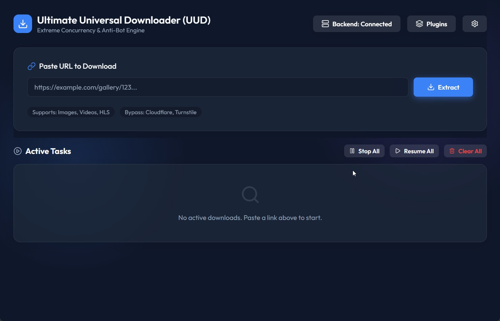

# Ultimate Universal Downloader (UUD)

UUD is a Windows-oriented desktop media downloader with a React interface, FastAPI backend, persistent task queue, and pluggable site extractors. It is designed for large galleries and collections without allowing one task or host to exhaust memory, network connections, or SQLite writes.



## Highlights

- **Bounded concurrency:** separate limits for active tasks, extraction work, items per task, all downloads, and each remote host.
- **Resilient downloads:** streamed asynchronous writes, retries with backoff, atomic `.part` replacement, delta downloads, and pause/cancel support.
- **Persistent state:** SQLite WAL mode, batched progress snapshots, recovery of interrupted tasks, and task/subfolder status tracking.
- **Responsive UI:** adaptive polling, memoized task cards, lazy thumbnails, incremental history rendering, ETA, logs, and partial-failure indicators.
- **Direct-first extraction:** plugins use HTTP/JSON metadata whenever possible. Playwright is an optional compatibility fallback for sites that genuinely require JavaScript execution.
- **Safer filesystem and API behavior:** validated URLs, hostname-aware plugin routing, path containment, Windows-safe names, and guarded file deletion.

Built-in extractors currently cover AllManga, AllPornComic, E-Hentai, EightMuses, HentaiFox, HentaiRead, Hitomi, Luscious, MangaHere, NHentai, NovelCrow, WeebCentral, and X/Twitter. Sites change frequently, so extractor support is best effort.

## Architecture

```text
React/Vite UI
    │ adaptive REST polling
FastAPI API ── SQLite task state (WAL)
    │
bounded task dispatcher
    │
site extractor ── direct HTTP/metadata ── optional Playwright fallback
    │
bounded item queue ── global limit ── per-host limit
    │
stream to .part ── validate ── atomic rename
```

The main components are:

- `main.py`: starts Uvicorn and the pywebview desktop window.
- `backend/api/`: task, settings, plugin, log, and image-proxy endpoints.
- `backend/core/`: queueing, downloading, media handling, configuration, and safe paths.
- `backend/plugins/`: the extractor contract, loader, and concurrency helpers.
- `plugins/`: one independent extractor module per supported site.
- `frontend/src/`: React application and styling.
- `tests/`: Python regression tests for core safety and concurrency behavior.

## Installation and Development

On Windows, run `Install_UUD.bat`, then `Start_UUD.bat`. Manual setup:

```powershell
pip install -r requirements.txt
playwright install chromium   # optional browser fallback
cd frontend
npm install
npm run build
cd ..
python main.py
```

Useful development commands:

```powershell
python -m uvicorn backend.app:app --reload
python -m unittest discover -s tests -v
python -m compileall -q main.py backend plugins tests
cd frontend
npm run dev
npm run lint
npm run build
```

## Configuration

Settings are stored in the project-level `settings.json` and can be edited through the UI.

| Setting | Default | Purpose |
| --- | ---: | --- |
| `max_concurrent_tasks` | 3 | Parent download pipelines running at once |
| `max_concurrent_items` | 5 | Download workers allocated to each task |
| `max_global_items` | 15 | Maximum downloads across all tasks |
| `max_concurrent_per_host` | 6 | Maximum downloads sent to one hostname |
| `max_extract_concurrency` | 8 | Upper bound for plugin metadata requests |
| `request_timeout_seconds` | 30 | Timeout for individual HTTP operations |

Engine-level concurrency changes take effect after restarting the application. Increase limits gradually: higher values can trigger rate limits and often reduce throughput on slower hosts.

## Writing an Optimized Plugin

Create one module in `plugins/` containing a `BaseExtractor` subclass. `URLS` entries are hostname-aware; declaring `example.com` already matches its subdomains. Add a path only when routing must be restricted, for example `example.com/gallery/`.

### Extractor contract

`extract(self, session)` receives a shared `curl_cffi.requests.AsyncSession`. It must set `self.title`, may set `self.thumbnail` and `self.flat_directory`, and returns media URLs or dictionaries.

| Media key | Required | Meaning |
| --- | --- | --- |
| `url` | Yes | Absolute HTTP(S) media URL |
| `referer` | No | Source page required by hotlink-protected CDNs |
| `folder` | No | Logical chapter/album subfolder |
| `filename` | No | Explicit output filename; the engine sanitizes it |
| `type` | No | Use `hls` for an HLS manifest; normal files need no type |

Prefer dictionaries because they preserve referers and grouping. Do not download media bytes inside the plugin—the core downloader handles streaming, retries, limits, cancellation, and atomic files.

### Production template

```python
from urllib.parse import urljoin

from bs4 import BeautifulSoup

from backend.core.config import get_settings
from backend.core.paths import sanitize_component
from backend.plugins.base import BaseExtractor
from backend.plugins.utils import bounded_map, deduplicate


class ExampleGalleryExtractor(BaseExtractor):
    URLS = ["example.com"]

    async def extract(self, session):
        settings = get_settings()
        timeout = settings["request_timeout_seconds"]
        self.extraction_errors = []

        response = await session.get(self.url, timeout=timeout)
        if response.status_code != 200:
            raise RuntimeError(f"Gallery returned HTTP {response.status_code}")

        soup = BeautifulSoup(response.text, "html.parser")
        heading = soup.select_one("h1")
        self.title = sanitize_component(
            heading.get_text(" ", strip=True) if heading else "Example Gallery",
            fallback="Example Gallery",
        )
        page_urls = deduplicate(
            urljoin(self.url, link["href"])
            for link in soup.select("a.gallery-page[href]")
        )
        if not page_urls:
            page_urls = [self.url]

        async def fetch_page(index_and_url):
            index, page_url = index_and_url
            page = await session.get(page_url, timeout=timeout)
            if page.status_code != 200:
                raise RuntimeError(f"Page {index + 1} returned HTTP {page.status_code}")
            page_soup = BeautifulSoup(page.text, "html.parser")
            items = [
                {"url": urljoin(page_url, image["src"]), "referer": page_url}
                for image in page_soup.select("img.content[src]")
            ]
            if not items:
                raise RuntimeError(f"Page {index + 1} contained no media")
            return index, items

        async def progress(completed, total, errors):
            await self.report_progress(
                phase="extracting",
                completed=completed,
                total=total,
                errors=errors,
            )

        results = await bounded_map(
            list(enumerate(page_urls)),
            fetch_page,
            limit=min(6, settings["max_extract_concurrency"]),
            return_exceptions=True,
            on_progress=progress,
        )

        self.extraction_errors = [
            str(result) for result in results if isinstance(result, Exception)
        ]
        successful = [result for result in results if isinstance(result, tuple)]
        successful.sort(key=lambda result: result[0])
        media = [item for _index, items in successful for item in items]
        media = deduplicate(media, key=lambda item: item["url"])
        if not media:
            raise RuntimeError("Every gallery page failed extraction")

        self.thumbnail = media[0]["url"]
        self.urls = media
        return media
```

This pattern keeps a fixed number of requests active, preserves source ordering, reports extraction progress, and allows a task to finish as `completed_with_errors` when only some pages fail.

### Performance rules

1. **Use the cheapest source first.** Prefer documented or discovered JSON/metadata endpoints, then HTML parsing, then embedded script data. Start Playwright only as a fallback.
2. **Bound all fan-out.** Use `bounded_map`; do not build thousands of coroutines for `asyncio.gather()` or call pages sequentially when independent requests can safely overlap.
3. **Respect both limits.** Cap site-specific concurrency with `min(site_limit, settings["max_extract_concurrency"])`. A conservative limit of 4–8 is usually a better starting point than dozens of requests.
4. **Set timeouts and check status codes.** Retry only transient failures such as 429 and 5xx, use short backoff, and never loop indefinitely.
5. **Preserve deterministic order.** Return an index with each worker result, sort successful results, then flatten and deduplicate them.
6. **Handle partial failure explicitly.** Store failed child operations in `self.extraction_errors`; raise only when no useful media remains.
7. **Keep the event loop non-blocking.** Use the injected async session, not `requests`; use `asyncio.sleep()`, not `time.sleep()`. Move unavoidable blocking work to `asyncio.to_thread()`.
8. **Do not trust remote names.** Use `sanitize_component()` for titles or logical folders. The downloader performs a second validation before touching the filesystem.

### Playwright fallback checklist

Browser navigation is much more expensive than direct HTTP requests. If it is unavoidable:

- reuse one browser for the extraction instead of launching one per page;
- block images, fonts, stylesheets, media, and ads when they are not needed;
- use `wait_until="domcontentloaded"` plus a specific selector/function timeout;
- extract compact metadata in one `page.evaluate()` call;
- close the browser in `finally`; and
- keep browser work bounded by `max_extract_concurrency`.

The Hitomi extractor in `plugins/hitomi.py` demonstrates the preferred design: cached direct metadata resolution on the normal path, bounded gallery workers, stable ordering, partial errors, and a browser fallback only if the direct endpoint changes.

### Validation checklist

Before submitting a plugin:

- test a single item, a small collection, and the largest practical collection;
- verify ordering, duplicate removal, referers, filenames, and subfolders;
- simulate one failed page and confirm remaining media is returned;
- confirm an unsupported URL is not routed to the plugin;
- run `python -m compileall -q plugins` and `python -m unittest discover -s tests -v`; and
- compare extraction time and peak concurrency before and after optimization.

## Contributing

See `AGENTS.md` for repository layout, coding conventions, tests, and pull-request expectations. New plugins should include a clear failure message and regression coverage for any reusable core behavior they add.

## Responsible Use

Respect website terms, copyright, rate limits, and local law. Do not commit downloaded media, task logs, local databases, credentials, or machine-specific settings.

---

© 2026 Created by Tom Huynh with love ❤️
